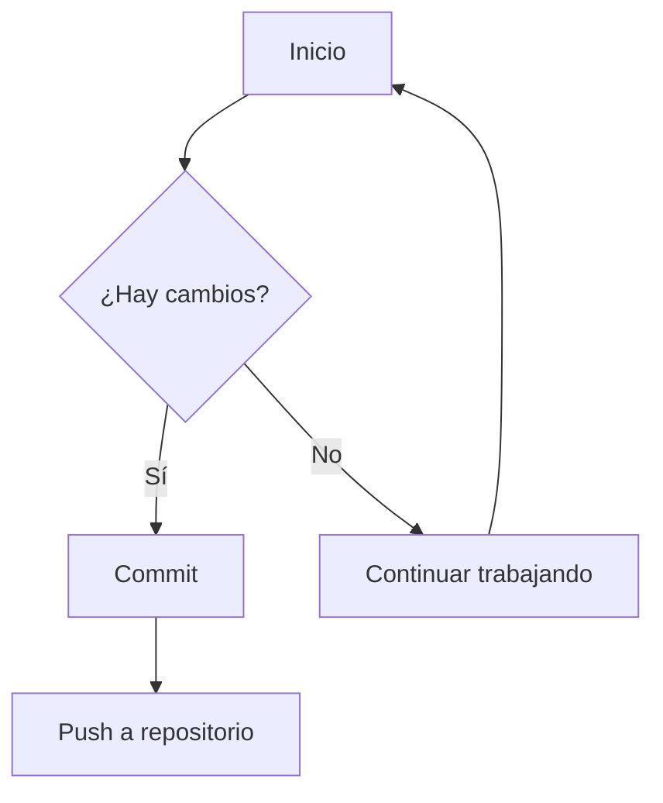

# 🚀 Neovim Configuration - LazyVim + OpenCode

Una configuración completa de Neovim basada en LazyVim con integración de OpenCode.nvim para asistencia con IA. Optimizada para desarrollo moderno con soporte para múltiples lenguajes de programación y renderizado avanzado de Markdown.

## 📋 Requisitos Previos

- [Neovim](https://neovim.io/) (versión 0.9.0 o superior)
- [Git](https://git-scm.com/)
- [Kitty](https://sw.kovidgoyal.net/kitty/) terminal (requerido para OpenCode.nvim)
- [Node.js](https://nodejs.org/) (para algunos LSPs)
- [Python](https://www.python.org/) (para formateadores y LSPs)

## 🛠️ Instalación

1. **Clonar la configuración:**
   ```bash
   git clone https://github.com/tu-usuario/nvim-config ~/.config/nvim
   ```

2. **Eliminar configuración existente (si aplica):**
   ```bash
   rm -rf ~/.config/nvim
   ```

3. **Iniciar Neovim:**
   ```bash
   nvim
   ```

4. **Esperar a que Lazy.nvim instale los plugins automáticamente**

## 🎯 Guía de Uso Básico de Neovim

### 🎮 Navegación Fundamental (hjkl)

La navegación en Vim/Neovim usa las siguientes teclas - ¡es más eficiente que usar las flechas!

| Tecla | Movimiento | Descripción |
|-------|------------|-------------|
| `h` | ← | Izquierda |
| `j` | ↓ | Abajo |
| `k` | ↑ | Arriba |
| `l` | → | Derecha |

**Movimientos Rápidos Adicionales:**
| Comando | Acción |
|---------|--------|
| `w` | Saltar a siguiente palabra |
| `b` | Saltar a palabra anterior |
| `0` | Inicio de línea |
| `$` | Fin de línea |
| `gg` | Inicio del archivo |
| `G` | Fin del archivo |
| `Ctrl + u` | Subir media pantalla |
| `Ctrl + d` | Bajar media pantalla |

**Modos Básicos:**
- `ESC` - Volver al modo normal (¡usar frecuentemente!)
- `i` - Entrar al modo inserción (escribir antes del cursor)
- `a` - Entrar al modo inserción (escribir después del cursor)
- `o` - Crear nueva línea abajo y entrar a modo inserción
- `O` - Crear nueva línea arriba y entrar a modo inserción
- `:` - Entrar al modo comandos
- `v` - Modo visual (seleccionar texto caracter por caracter)
- `V` - Modo visual línea (seleccionar líneas enteras)
- `Ctrl + v` - Modo visual bloque (seleccionar columnas)

**Comandos Esenciales para Principiantes:**
| Comando | Acción |
|---------|--------|
| `:w` | Guardar archivo |
| `:q` | Salir |
| `:wq` | Guardar y salir |
| `:q!` | Salir sin guardar |
| `:e nombre.txt` | Abrir archivo |
| `:w nombre.txt` | Guardar como |
| `:help tema` | Ayuda sobre un tema |
| `u` | Deshacer |
| `Ctrl + r` | Rehacer |
| `dd` | Eliminar línea completa |
| `yy` | Copiar línea completa |
| `p` | Pegar después del cursor |
| `P` | Pegar antes del cursor |

## 🧩 Gestión de Ventanas

### Movimiento entre Ventanas

| Atajo | Acción |
|-------|--------|
| `<C-h>` | Mover cursor a ventana izquierda |
| `<C-j>` | Mover cursor a ventana inferior |
| `<C-k>` | Mover cursor a ventana superior |
| `<C-l>` | Mover cursor a ventana derecha |

### Redimensionar Ventanas

| Atajo | Acción |
|-------+--------|
| `<C-left>` | Reducir ancho ventana |
| `<C-right>` | Aumentar ancho ventana |
| `<C-up>` | Aumentar alto ventana |
| `<C-down>` | Reducir alto ventana |

### Creación de Ventanas

| Comando | Acción |
|---------|--------|
| `:split` o `:sp` | Dividir ventana horizontalmente |
| `:vsplit` o `:vs` | Dividir ventana verticalmente |
| `<C-w>c` | Cerrar ventana actual |
| `<C-w>o` | Cerrar todas excepto la actual |

### Navegación de Buffers (Pestañas)

| Atajo | Acción |
|-------|--------|
| `<Tab>` | Siguiente buffer |
| `<S-Tab>` | Buffer anterior |
| `<leader>1` | Ir al buffer 1 |
| `<leader>2` | Ir al buffer 2 |
| `<leader>3` | Ir al buffer 3 |
| `<leader>4` | Ir al buffer 4 |
| `<leader>5` | Ir al buffer 5 |

## 🤖 Integración con OpenCode.nvim

OpenCode.nvim proporciona asistencia con IA directamente en Neovim.

### Atajos Principales

| Atajo | Acción | Descripción |
|-------|--------|-------------|
| `<leader>oa` | Ask | Preguntar a OpenCode con contexto actual |
| `<leader>os` | Select | Seleccionar acción de OpenCode desde menú |
| `<leader>ot` | Toggle | Alternar sesión de OpenCode |
| `<leader>oe` | Explain | Explicar código seleccionado |
| `<leader>of` | Fix | Corregir diagnósticos/errores |
| `<leader>ov` | Review | Revisar código |
| `<leader>od` | Document | Agregar documentación |
| `<leader>op` | Test | Agregar pruebas |
| `<leader>or` | Add range | Agregar rango al prompt |
| `<leader>ol` | Add line | Agregar línea actual al prompt |

**Nota:** `<leader>` es la barra espaciadora (`<space>`) por defecto.

### Ejemplos de Uso

1. **Explicar código:**
   - Selecciona el código con `v` o `V`
   - Presiona `<leader>oe`
   - OpenCode explicará qué hace el código

2. **Corregir errores:**
   - Posiciona el cursor en una línea con errores
   - Presiona `<leader>of`
   - OpenCode sugerirá correcciones

3. **Agregar pruebas:**
   - Selecciona una función
   - Presiona `<leader>op`
   - OpenCode generará pruebas unitarias

4. **Preguntar sobre código:**
   - Presiona `<leader>oa`
   - Escribe tu pregunta sobre el código actual

## 🔍 Búsqueda y Navegación

### Telescope (Buscador Fuzzy)

| Atajo | Acción |
|-------|--------|
| `<leader>ff` | Buscar archivos |
| `<leader>fg` | Buscar en contenido (live grep) |
| `<leader>fb` | Buscar buffers |
| `<leader>fh` | Buscar ayuda |
| `<leader>fc` | Buscar comandos |

### Flash Navegación Rápida

| Atajo | Acción |
|-------|--------|
| `s` | Saltar a cualquier caracter visible |
| `S` | Saltar usando Treesitter (más inteligente) |

### Navegación LSP

| Atajo | Acción |
|-------|--------|
| `<leader>gd` | Ir a definición |
| `<leader>gr` | Ir a referencias |
| `<leader>gi` | Ir a implementación |
| `<leader>k` | Mostrar documentación flotante |
| `<leader>rn` | Renombrar símbolo |
| `<leader>ca` | Acciones de código |

## 📝 Edición Avanzada

### Autocompletado

| Tecla | Acción |
|-------|--------|
| `<C-Space>` | Activar autocompletado |
| `<Tab>` | Seleccionar siguiente item / expandir snippet |
| `<S-Tab>` | Seleccionar item anterior |
| `<CR>` | Confirmar selección |

### Formateo

| Atajo | Acción |
|-------|--------|
| `<leader>fm` | Formatear buffer actual |

### Diagnósticos

| Atajo | Acción |
|-------|--------|
| `<leader>e` | Mostrar diagnósticos flotantes |
| `[d` | Ir a diagnóstico anterior |
| `]d` | Ir a siguiente diagnóstico |

## 📝 Markdown - Herramientas Especializadas

Esta configuración incluye herramientas avanzadas para edición de Markdown con renderizado automático y LSP inteligente.

### 🎨 Renderizado Automático (render-markdown.nvim)

**Características principales:**
- ✅ **Auto-enable**: Se activa automáticamente en archivos `.md`
- 🎯 **Renderizado en tiempo real**: Mejora visual de todos los elementos markdown
- 📊 **Tablas formateadas**: Bordes y alineación automáticos
- 🎨 **Encabezados personalizados**: Iconos y estilos diferenciados
- 💻 **Bloques de código**: Con sintaxis highlighting y bordes
- ✅ **Checkboxes interactivos**: Estilos visuales para tareas
- 🔗 **Enlaces mejorados**: Iconos diferenciados para tipos de enlaces
- 📝 **Listas con bullets**: Estilos personalizados para diferentes niveles

**Atajos de control:**
| Atajo | Acción |
|-------|--------|
| `<leader>mr` | Toggle render markdown |
| `<leader>me` | Enable render markdown |
| `<leader>md` | Disable render markdown |

### 🌐 Previsualización en Navegador (markdown-preview.nvim)

| Atajo | Acción |
|-------|--------|
| `<leader>mp` | Alternar previsualización markdown |
| `<leader>ms` | Iniciar previsualización |
| `<leader>mq` | Detener previsualización |

**Características del Preview:**
- 🔄 **Actualización automática** al guardar
- 🎨 **Sintaxis completa** con highlighting
- 📊 **Diagramas Mermaid** renderizados
- 📊 **Tablas y listas** formateadas
- 🔗 **Enlaces internos** funcionales
- 🌙 **Tema oscuro/claro** automático

### 🧠 LSP Inteligente para Markdown (Marksman)

| Característica | Descripción |
|--------------|-------------|
| **Autocompletado** | Sugerencias inteligentes de enlaces, referencias |
| **Diagnósticos** | Detección de enlaces rotos, referencias faltantes |
| **Go to Definition** | Salta a archivos referenciados |
| **Rename** | Renombra símbolos y referencias |
| **Workspace** | Detecta archivos relacionados en el repositorio |

### 🔧 Formateo y Linting

| Herramienta | Función |
|------------|---------|
| **Prettier** | Formatea estilo, listas, tablas |
| **markdownlint-cli2** | Detecta problemas de estilo y sintaxis |
| **Autofix** | Corrige automáticamente problemas comunes |

### 📊 Diagramas Mermaid

Para incluir diagramas en tus archivos markdown:

```markdown
## 📊 Diagrama de Flujo


```

### 🎯 Comandos Útiles para Markdown

| Comando | Descripción |
|---------|-------------|
| `<leader>fm` | Formatear archivo actual |
| `<leader>gd` | Ir a definición de enlace |
| `<leader>rn` | Renombrar referencia |
| `<leader>k` | Mostrar documentación flotante |
| `[d` | Siguiente diagnóstico |
| `]d` | Diagnóstico anterior |

## 🎯 Integración con Git

### Comandos Git Principales

| Atajo | Acción |
|-------|--------|
| `<leader>gs` | Estado de Git |
| `<leader>gc` | Hacer commit |
| `<leader>gp` | Hacer push |
| `<leader>gl` | Hacer pull |

### Gitsigns (Navegación de Cambios)

| Atajo | Acción |
|-------+--------|
| `]c` | Siguiente hunk de Git |
| `[c` | Hunk anterior de Git |
| `<leader>hs` | Stage del hunk actual |
| `<leader>hr` | Reset del hunk actual |
| `<leader>hp` | Previsualizar hunk |
| `<leader>hb` | Blame de línea |
| `<leader>hS` | Stage del buffer completo |
| `<leader>hR` | Reset del buffer completo |

## 🧪 Testing

### Neotest

| Atajo | Acción |
|-------|--------|
| `<leader>tt` | Ejecutar tests del archivo |
| `<leader>tn` | Ejecutar test más cercano |
| `<leader>ts` | Mostrar/ocultar resumen de tests |
| `<leader>to` | Mostrar salida de test |

## 🐛 Depuración (Debugging)

### DAP (Debug Adapter Protocol)

| Atajo | Acción |
|-------+--------|
| `<leader>db` | Toggle breakpoint |
| `<leader>dc` | Continuar ejecución |
| `<leader>do` | Step over |
| `<leader>di` | Step into |
| `<leader>dO` | Step out |
| `<leader>dr` | Abrir REPL |
| `<leader>dl` | Ejecutar última configuración |

## 💾 Gestión de Sesiones

### Persistence

| Atajo | Acción |
|-------+--------|
| `<leader>qs` | Restaurar sesión |
| `<leader>ql` | Restaurar última sesión |
| `<leader>qd` | No guardar sesión actual |

## 🖥️ Terminal

### ToggleTerm

| Atajo | Acción |
|-------+--------|
| `<C-\>` | Alternar terminal flotante |

## 🎨 Temas y Personalización

### Cambiar Tema

Los temas están configurados en `lua/plugins/ui.lua`. Para cambiar el tema:

1. Editar el archivo `lua/plugins/ui.lua`
2. Cambiar el valor de `vim.cmd.colorscheme`
3. Recargar Neovim con `:source %`

### Configuración Adicional

- **Opciones:** `lua/config/options.lua`
- **Keymaps:** `lua/config/keymaps.lua`
- **Autocomandos:** `lua/config/autocmds.lua`

## 🔧 Mantenimiento

### Actualizar Plugins

```vim
:Lazy update    # Actualizar todos los plugins
:Lazy clean     # Limpiar plugins no usados
:Lazy install   # Instalar plugins faltantes
```

### Formatear Código

```bash
# Formatear todos los archivos Lua
stylua .

# Verificar formato sin cambiar
stylua --check .
```

### Verificar Configuración

```vim
:checkhealth lazyvim    # Verificar salud de LazyVim
:checkhealth           # Verificación general de Neovim
```

## 📁 Estructura del Proyecto

```
lua/
├── config/              # Configuración core
│   ├── lazy.lua        # Bootstrap de Lazy.nvim
│   ├── options.lua     # Opciones de Neovim
│   ├── keymaps.lua     # Mapeos de teclas
│   └── autocmds.lua    # Autocomandos
└── plugins/            # Configuración de plugins
    ├── desarrollo.lua  # LSP, formateo, git, testing, debugging
    ├── productividad.lua # Telescope, flash, autocompletado, terminal
    ├── ui.lua         # Temas e interfaz
    ├── opencode.lua   # OpenCode.nvim
    ├── render-markdown.lua # Renderizado avanzado de markdown
    └── extras.lua     # Plugins adicionales
```

### Herramientas Markdown Instaladas

| Herramienta | Ubicación | Función |
|------------|----------|---------|
| **render-markdown.nvim** | Lazy plugin | Renderizado automático en Neovim |
| **Marksman** | System + Mason | LSP inteligente para markdown |
| **markdownlint-cli2** | Global npm | Linting y validación |
| **Mermaid CLI** | Global npm | Diagramas y visualizaciones |
| **markdown-preview.nvim** | Lazy plugin | Previsualización en navegador |

## 🚀 Comenzando Rápido (Workflow Básico)

### Para Archivos Markdown

1. **Abrir archivo:** `nvim README.md`
2. **Renderizado automático:** Ya está activo al abrir el archivo
3. **Controlar renderizado:** `<leader>mr` para toggle si es necesario
4. **Iniciar preview en navegador:** `<leader>mp`
5. **Escribir con LSP:** Autocompletado de enlaces y referencias
6. **Formatear:** `<leader>fm`
7. **Verificar enlaces:** `<leader>gd` sobre enlaces, diagnósticos automáticos
8. **Agregar diagramas:** Usa bloques Mermaid para visualizaciones

### Para Código General

1. **Abrir Neovim:** `nvim .` (abre directorio actual)
2. **Navegar archivos:** Usa `<leader>ff` para buscar archivos
3. **Moverse eficientemente:** Usa `hjkl` para navegación básica, `w/b` para saltos de palabras
4. **Editar código:** Presiona `i` para escribir, `ESC` para salir
5. **Dividir ventanas:** Usa `:sp` (horizontal) o `:vs` (vertical)
6. **Mover entre ventanas:** Usa `Ctrl + h/j/k/l`
7. **Explicar código con IA:** Selecciona con `v`, luego `<leader>oe`
8. **Formatear código:** `<leader>fm`
9. **Guardar y salir:** `:wq`

## 💡 Tips para Principiantes

### Para Markdown
- **Renderizado automático:** Los archivos `.md` se renderizan automáticamente al abrirlos
- **LSP Inteligente:** Escribe `[` y el LSP sugerirá enlaces del proyecto
- **Preview en vivo:** Usa `<leader>mp` para ver cambios en tiempo real en el navegador
- **Diagramas sencillos:** Usa Mermaid para gráficos sin herramientas externas
- **Validación automática:** Los errores de sintaxis se detectan solos

### Para Uso General
- **Practica hjkl:** Al principio parece lento pero luego es mucho más rápido
- **Usa ESC frecuentemente:** Vuelve siempre al modo normal antes de nuevos comandos
- **Aprovecha la IA:** Usa `<leader>oe` para entender código que no conoces
- **Divide tu espacio:** Trabaja con múltiples ventanas para ver código y tests
- **Usa Telescope:** `<leader>ff` es tu mejor amigo para encontrar archivos
- **Formatea automáticamente:** `<leader>fm` mantiene tu código limpio

### Atajos Esenciales
- **Markdown:** `<leader>mr` (toggle render), `<leader>mp` (preview navegador), `<leader>fm` (formato)
- **Navegación:** `hjkl` (básico), `w/b` (palabras), `<leader>gd` (definición)
- **Ventanas:** `Ctrl + h/j/k/l` (mover), `:sp/:vs` (dividir)
- **Búsqueda:** `<leader>ff` (archivos), `<leader>fg` (contenido)

## 🎊 Estado del Sistema

### ✅ Verificación Completa (LazyHealth)

Todos los componentes están verificados y funcionando correctamente:

| Componente | Estado | Verificación |
|-----------|--------|-------------|
| **render-markdown.nvim** | ✅ OK | Renderizado automático activo |
| **Marksman LSP** | ✅ OK | Markdown LSP funcional |
| **markdownlint-cli2** | ✅ OK | Linting activo |
| **Mermaid CLI** | ✅ OK | Diagramas listos |
| **markdown-preview.nvim** | ✅ OK | Preview en tiempo real |
| **Lazy.nvim** | ✅ OK | Gestión de plugins |
| **Mason** | ✅ OK | Herramientas instaladas |
| **Treesitter** | ✅ OK | Syntax highlighting |

### 🎯 Herramientas Markdown Listas

```bash
# Verificación de herramientas instaladas:
✅ render-markdown.nvim: OK (auto-enable)
✅ marksman: OK
✅ markdownlint-cli2: OK  
✅ mmdc: OK
✅ Configuración: Cargada
✅ Sistema: Listo para desarrollo markdown avanzado
```

## 🤝 Contribución

Esta configuración está basada en:

- [LazyVim](https://github.com/LazyVim/LazyVim) - Configuración base
- [OpenCode.nvim](https://github.com/NickvanDyke/opencode.nvim) - Integración con IA
- [render-markdown.nvim](https://github.com/MeanderingProgrammer/render-markdown.nvim) - Renderizado avanzado de Markdown
- [Marksman](https://github.com/artempyanykh/marksman) - LSP para Markdown
- [markdown-preview.nvim](https://github.com/iamcco/markdown-preview.nvim) - Previsualizador

## 📄 Licencia

MIT License - Siéntete libre de usar, modificar y distribuir esta configuración.