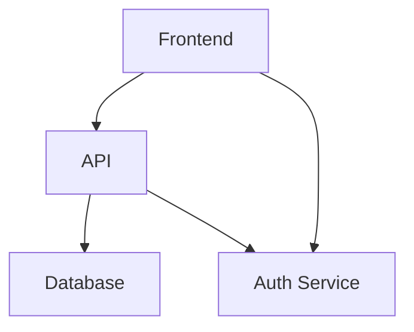

# 📚 Neovim Configuration: Statick - Tutorial Completo

Configuración personalizada de Neovim desarrollada por **Statick Medardo Saavedra García**, profesional de TI con más de 8 años de experiencia en desarrollo **Fullstack** y **Educación Superior**.

---

## 📋 Tabla de Contenidos

- [🎯 Día 1: Fundamentos de Neovim](#-día-1-fundamentos-de-neovim)
- [🔍 Día 2: Búsqueda y Navegación](#-día-2-búsqueda-y-navegación)
- [💡 Día 3: LSP y Autocompletado](#-día-3-lsp-y-autocompletado)
- [🐙 Día 4: Git Integration](#-día-4-git-integration)
- [📝 Día 5: Gestión de Notas con Obsidian](#-día-5-gestión-de-notas-con-obsidian)
- [🎨 Día 6: Excalidraw - Diagramas](#-día-6-excalidraw---diagramas)
- [🔬 Día 7: Quarto - Documentos Científicos](#-día-7-quarto---documentos-científicos)
- [🐦 Día 8: Flutter Development](#-día-8-flutter-development)
- [🐍 Día 9: Python Development](#-día-9-python-development)
- [🧪 Día 10: Testing](#-día-10-testing)
- [🏗️ Stack Tecnológico](#-stack-tecnológico)
- [📁 Estructura del Proyecto](#-estructura-del-proyecto)
- [🔧 Solución de Problemas](#-solución-de-problemas)

---

## 🎯 Día 1: Fundamentos de Neovim

### 📖 Modos de Neovim

Neovim tiene 4 modos principales que debes dominar:

| Modo | Tecla | Descripción | Cómo entrar |
|-------|-------|-------------|-------------|
| **Normal** | `Esc` | Navegar y ejecutar comandos | Presiona `Esc` desde cualquier modo |
| **Insert** | `i` | Escribir texto | Presiona `i` desde modo Normal |
| **Visual** | `v` | Seleccionar texto | Presiona `v` desde modo Normal |
| **Command** | `:` | Ejecutar comandos | Presiona `:` desde modo Normal |

### ⌨️ Comandos Esenciales

| Comando | Acción | Ejemplo |
|---------|--------|---------|
| `:w` | Guardar | `:w` - Guarda el archivo actual |
| `:q` | Salir | `:q` - Cierra Neovim |
| `:wq` | Guardar y salir | `:wq` - Combina w + q |
| `:q!` | Salir sin guardar | `:q!` - Cierra sin guardar cambios |
| `u` | Deshacer | `u` - Deshace el último cambio |
| `Ctrl+r` | Rehacer | `Ctrl+r` - Rehace el último deshacer |

### 🧭 Navegación Básica

| Tecla | Acción | Atajo alternativo |
|-------|--------|------------------|
| `h/j/k/l` | Izquierda/Abajo/Arriba/Derecha | ←/↓/↑/→ |
| `w` | Siguiente palabra | `e` |
| `b` | Palabra anterior | `ge` |
| `dd` | Borrar línea | `yy` copia, `p` pega |
| `0` | Inicio de línea | `^` |
| `$` | Fin de línea | `G` |
| `gg` | Inicio del archivo | `:1` |
| `G` | Fin del archivo | `:$` |

### 🚀 Tu Primer Archivo

```bash
# 1. Crear un archivo de prueba
nvim hola_mundo.py

# 2. Escribir código Python
i
def saludo():
    print("¡Hola Mundo desde Neovim!")
    return "Funcionando correctamente"

# 3. Guardar y salir
<Esc>:wq

# 4. Verificar que se creó
cat hola_mundo.py
```

**Resultado esperado:**
```
def saludo():
    print("¡Hola Mundo desde Neovim!")
    return "Funcionando correctamente"
```

### 💡 Tip Rápido: Salir del modo Insert

**Atajo personalizado:** `jj` (presiona `j` dos veces)

```bash
# Configurado en: lua/statick/core/keymaps.lua
keymap.set("i", "jj", "<ESC>")

# En modo Insert:
# Escribe "jj" → Vuelves al modo Normal automáticamente
```

---

## 🔍 Día 2: Búsqueda y Navegación

### 🔎 Which-key.nvim - Tu menú de atajos

Which-key te muestra todos los atajos disponibles cuando presiones `<leader>` (Espacio).

**¿Qué es `<leader>`?**
- Es la tecla **Espacio** en esta configuración
- Configurado en: `vim.g.mapleader = " "`

**Uso:**
```bash
# 1. Abrir Neovim
nvim

# 2. Presionar Espacio (tu leader)
# → Verás un menú organizado por categorías

# Ejemplo de menú que verás:
# ╭─────────────────────────────────╮
# │ +explorer        │
# │ +find           │
# │ +productivity    │
# │ +git            │
# │ +obsidian       │
# │ +python         │
# │ +flutter         │
# │ +testing         │
# │ +lsp            │
# ╰─────────────────────────────────╯
```

**Explorando categorías:**
```bash
# 1. Presiona Espacio para ver menú
<leader>

# 2. Navega con flechas (↑/↓/←/→)
↓
# Selecciona una categoría

# 3. Presiona Enter
<Enter>
# → Verás atajos de esa categoría
```

### 🔍 Telescope.nvim - Búsqueda Inteligente

**Comandos principales:**

| Atajo | Descripción | Uso práctico |
|-------|-------------|---------------|
| `<leader>ff` | Buscar archivos | `nvim` → `<leader>ff` → `archivo.py` → Enter |
| `<leader>fg` | Buscar texto | `<leader>fg` → `function` → Enter |
| `<leader>fb` | Buscar buffers | `<leader>fb` → Selecciona archivo abierto |
| `<leader>fh` | Buscar ayuda | `<leader>fh` → `:help` → Enter |

**Ejemplo práctico - Buscar una función específica:**
```bash
# 1. Abrir tu proyecto
nvim ~/tu-proyecto

# 2. Buscar texto (<leader>fg)
<leader>fg

# 3. Escribir el texto a buscar
def mi_funcion
<Enter>

# 4. Navegar con flechas
↓ / ↑

# 5. Presiona Enter para abrir el archivo
<Enter>
```

**Características útiles de Telescope:**
- **Búsqueda fuzzy**: Escribe cualquier parte del nombre
- **Previsualización**: Ve el contenido antes de abrir
- **Filtros**: `Ctrl+f` para filtrar por tipo
- **Preview**: `Ctrl+p` para ver preview con teclado

### ⚡ Flash.nvim - Navegación Rápida

Flash te permite saltar a cualquier parte del archivo rápidamente.

| Atajo | Descripción |
|-------|-------------|
| `s` | Saltar a cualquier letra |
| `S` | Saltar a Treesitter (función, clase, etc.) |

**Uso práctico:**
```bash
# 1. Abrir un archivo grande
nvim archivo_grande.py

# 2. Buscar una palabra lejana
s

# 3. Escribir la letra
variable
<Enter>

# 4. ¡Listo! El cursor saltó a la primera ocurrencia
```

**Navegación con Flash:**
- Escribe la letra/palabra para saltar
- `Enter` para confirmar
- `Esc` para cancelar

---

## 💡 Día 3: LSP y Autocompletado

### 🌟 nvim-cmp - Autocompletado Inteligente

**¿Qué es el autocompletado?**
- Sugiere funciones, variables, tipos mientras escribes
- Funciona como IntelliSense en VS Code
- Aparece automáticamente mientras escribes

**Fuentes de autocompletado:**
```bash
# nvim-cmp consulta estas fuentes en orden:

1. nvim_lsp (LSP)     ← Prioridad más alta
2. luasnip (Snippets)      ← Fragmentos de código
3. path (Rutas)          ← Archivos en el proyecto
4. buffer (Archivo actual)   ← Palabras del archivo

# Ejemplo en Python:
def mi_funcion():
    │           ↑
    │          │
print("hola")
    │     nvim_lsp, luasnip, path, buffer
```

**Atajos de autocompletado:**
| Tecla | Acción |
|-------|--------|
| `Tab` | Siguiente sugerencia |
| `Shift+Tab` | Sugerencia anterior |
| `Enter` | Aceptar sugerencia |
| `Ctrl+Space` | Forzar menú |

**Ejemplo práctico:**
```python
# 1. Crear un archivo Python
nvim test.py

# 2. Escribir código
import numpy as np
│   ↑
│   │  nvim_lsp sugiere numpy

def calculadora(a, b):
    return a + b
```

### 🤖 LSP (Language Server Protocol)

**¿Qué es LSP?**
- Proporciona inteligencia de lenguaje
- Navegación a definiciones, referencias
- Documentación, errores, warnings

**Atajos principales:**
| Atajo | Descripción | Uso |
|-------|-------------|------|
| `gd` | Ir a definición | Colócate sobre función → `gd` |
| `gr` | Buscar referencias | Colócate sobre función → `gr` |
| `K` | Ver documentación | Colócate sobre función → `K` |
| `]d` / `[d` | Siguiente/anterior error | Navegar entre errores |
| `<leader>rn` | Renombrar símbolo | `<leader>rn` → Nuevo nombre |
| `<leader>ca` | Code actions | `<leader>ca` → Ver acciones disponibles |

**Ejemplo práctico completo:**
```python
# 1. Abrir un archivo Python
nvim proyecto/main.py

# 2. Ver definición de una función
def procesar_datos(datos):
    # Colócate aquí y presiona gd
    datos = procesar_datos(datos)

# 3. Ver documentación de una función
def procesar_datos(datos):
    """
    Procesa los datos del usuario
    Args:
        datos: Lista de datos
    """
    # Colócate en la función y presiona K
    return datos

# 4. Renombrar una función
def funcion_antigua(nombre):
    return nombre.upper()
    # Colócate en funcion_antigua
    # Presiona <leader>rn
    # Escribe: funcion_nueva
    <Enter>

# 5. Code actions (arreglar problemas)
def funcion_nueva(nombre):
    # Colócate en funcion_nueva
    # Presiona <leader>ca
    # Verás opciones como:
    # - Add type hints
    # - Add docstring
    # - Organize imports
```

---

## 🐙 Día 4: Git Integration

### 📊 Gitsigns.nvim - Indicadores de Cambios

**¿Qué son Gitsigns?**
- Muestra cambios en el gutter (margen izquierdo)
- Colores diferentes para cada tipo de cambio
- Navegación entre hunks (bloques de cambios)

**Indicadores visuales:**
```
+  Línea agregada (verde)
~  Línea modificada (amarillo)
_  Línea eliminada (rojo)
```

**Atajos de Gitsigns:**
| Atajo | Descripción |
|-------|-------------|
| `]c` | Siguiente hunk |
| `[c` | Hunk anterior |
| `<leader>hs` | Stage hunk (agregar a commit) |
| `<leader>hr` | Reset hunk (deshacer hunk) |

**Ejemplo práctico:**
```bash
# 1. Abrir un archivo modificado
nvim archivo_modificado.py

# 2. Verás indicadores en el gutter
┌──────────────────────┐
│ + def nueva_funcion│ ← Línea agregada
│ ~     return True    │ ← Línea modificada
└──────────────────────┘

# 3. Navegar entre cambios
]c → Siguiente hunk
[c → Hunk anterior

# 4. Agregar solo un hunk al commit
# Colócate en un hunk
<leader>hs

# 5. Deshacer un hunk
# Colócate en un hunk
<leader>hr
```

### 🎯 LazyGit.nvim - Interfaz Git Visual

**¿Qué es LazyGit?**
- Interfaz TUI (Terminal UI) para Git
- Similar a gitk pero más moderno
- Comandos visuales con teclado

**Atajos principales:**
| Atajo | Descripción |
|-------|-------------|
| `<leader>gg` | Abrir LazyGit |

**Uso práctico:**
```bash
# 1. Abrir LazyGit
nvim tu-proyecto
<leader>gg

# 2. Verás la interfaz visual:
# ╔════════════════════════════╗
# │ 📁 Files    │ 📊 Status  │
# │ 📝 Commits  │ 🔀 Branches │
# ╚════════════════════════════╝

# 3. Navegar con flechas
# 4. Usar comandos:
#   - s: Status
#   - f: Files
#   - c: Commits
#   - b: Branches

# 5. Stage un archivo
#   Navega a Files
#   Selecciona archivo
#   <Space> para stage/unstage

# 6. Hacer commit
#   Navega a Commits
#   c: Commit
#   Escribe el mensaje del commit
```

### 🔍 Diffview.nvim - Visualización de Diffs

**Atajos principales:**
| Atajo | Descripción |
|-------|-------------|
| `<leader>gvo` | Abrir diffview |
| `<leader>gvc` | Cerrar diffview |

**Uso práctico:**
```bash
# 1. Comparar dos commits
nvim tu-proyecto
<leader>gvo

# 2. Verás diff lado a lado:
# ┌─────────────────┬─────────────────┐
# │ Archivo local │ Archivo remoto │
# ├─────────────────┼─────────────────┤
# │ - linea1       │ + linea1       │
# │   linea2       │   linea2       │
# │ - linea3       │ + linea3       │
# └─────────────────┴─────────────────┘

# 3. Navegar entre archivos
#   Tab/I: Cambiar entre local/remoto

# 4. Navegar entre cambios
#   [d / ]d: Cambio siguiente/anterior
```

### 🔀 Git-conflict.nvim - Resolver Conflictos

**Atajos para resolver conflictos:**
| Atajo | Descripción |
|-------|-------------|
| `<leader>gco` | Elegir "ours" (tus cambios) |
| `<leader>gct` | Elegir "theirs" (cambios del otro) |
| `<leader>gcb` | Elegir "both" (ambos) |
| `<leader>gc0` | Elegir "none" (ninguno) |

**Ejemplo práctico:**
```python
# 1. Archivo con conflicto:
def funcion_conflictiva():
<<<<<<< HEAD
    return "versión_local"
=======
    return "versión_remota"
>>>>>>> branch-feature
    pass

# 2. Colócate en el conflicto
# 3. Presiona <leader>gco para elegir tu versión
# Resultado:
def funcion_conflictiva():
    return "versión_local"
    pass
```

---

## 📝 Día 5: Gestión de Notas con Obsidian

### 📚 Obsidian.nvim - Tu Segundo Cerebro

**¿Qué es Obsidian?**
- Sistema de gestión de notas potente
- Links bidireccionales (backlinks)
- Plantillas, tags, diarios
- Compatible con Obsidian app y standalone

**Características principales:**
```
✅ Notas diarias (today, yesterday, tomorrow)
✅ Búsqueda y cambio rápido (Telescope)
✅ Links inteligentes (wiki y markdown)
✅ Plantillas reutilizables
✅ Backlinks (qué notas enlazan a la actual)
✅ Tabla de contenidos automática
✅ Compatibilidad con Markdown completo
```

### ⌨️ Atajos de Obsidian

| Atajo | Descripción |
|-------|-------------|
| `<leader>on` | Nueva nota |
| `<leader>oo` | Buscar notas |
| `<leader>os` | Cambiar nota |
| `<leader>ot` | Nota de hoy |
| `<leader>oy` | Nota de ayer |
| `<leader>om` | Nota de mañana |
| `<leader>ob` | Ver backlinks |
| `<leader>ol` | Ver links |
| `<leader>oc` | Seguir link |
| `<leader>oi` | Pegar imagen |
| `<leader>ota` | Tabla de contenidos |
| `<leader>otp` | Insertar plantilla |

### 📝 Tutorial Completo de Obsidian

#### Paso 1: Crear tu primera nota

```bash
# 1. Abrir Neovim
nvim

# 2. Crear nueva nota
<leader>on

# 3. Escribir título
# Obsidian.nvim - Nueva nota
# Título: Mi primera nota

# Contenido:
# Esta es mi primera nota en Obsidian.

## Características
- [[Links bidireccionales]]
- [[Tags]]
- [[Plantillas]]

---

# 4. Guardar
:wq
```

#### Paso 2: Crear nota diaria

```bash
# 1. Abrir nota de hoy
nvim
<leader>ot

# 2. El archivo se crea automáticamente
# Nombre: ~/Documents/notes/daily/2026-01-03.md

# 3. Contenido ejemplo:
---
date: 2026-01-03
tags: [daily]
---

# Tareas del día

## Por hacer
- [ ] Revisar código
- [ ] Revisar PRs
- [ ] Actualizar documentación

## Notas
- Tengo una reunión a las 3pm
- Comenzar nuevo proyecto mañana

# 4. Guardar
:wq
```

#### Paso 3: Crear links entre notas

```bash
# 1. Abrir nota A
nvim ~/Documents/notes/proyecto_alpha.md

# 2. Añadir link a nota B
## Enlaces importantes

- [[proyecto_beta]]: Proyecto relacionado
- [[documentacion]]

# 3. Colócate en el link y presiona:
<leader>oc

# 4. Obsidian te lleva a la nota destino
```

#### Paso 4: Usar backlinks

```bash
# 1. Abrir una nota
nvim ~/Documents/notes/proyecto_alpha.md

# 2. Ver qué notas enlazan a esta
<leader>ob

# 3. Verás algo como:
# ╭────────────────────────────────╮
# │ Backlinks to this note        │
# │                                │
# │  • proyecto_beta              │
# │  • documentacion            │
# │  • planning_mensual          │
# ╰────────────────────────────────╯

# 4. Presiona Enter para abrir
```

#### Paso 5: Usar plantillas

```bash
# 1. Crear archivo de plantilla
nvim ~/Documents/notes/templates/reunion.md

# 2. Contenido de la plantilla:
---
date: {{ date }}
tags: [template]

# Reunión

## Asistentes
- [ ]
- [ ]
- [ ]

## Agenda
1. 
2. 
3. 

## Notas
- 

# 3. Guardar
:wq

# 4. Usar la plantilla en una nueva nota
<leader>otp

# 5. Selecciona la plantilla
# 6. Se inserta el contenido de la plantilla
```

### 🔍 Búsqueda Avanzada con Obsidian

```bash
# 1. Buscar notas (<leader>oo)
nvim
<leader>oo

# 2. Escribir texto a buscar
proyecto

# 3. Navegar con flechas
↓ / ↑

# 4. Enter para abrir la nota
<Enter>

# 5. Cambiar entre notas rápidamente (<leader>os)
# Busca otra palabra
otra_palabra
<leader>os

# 6. Navega entre los resultados
Tab / Shift+Tab
```

---

## 🎨 Día 6: Excalidraw - Diagramas

### 🎯 ¿Qué es Excalidraw?

- **Diagramas en Markdown**
- Integración directa con Excalidraw online
- No necesitas salir de Neovim
- Crea diagramas UML, arquitectura, wireframes

### ⌨️ Atajos de Excalidraw

| Atajo | Descripción |
|-------|-------------|
| `<leader>ed` | Abrir link bajo el cursor |
| `<leader>ec` | Crear nueva escena |
| `<leader>et` | Crear desde plantilla |
| `<leader>ef` | Buscar escenas guardadas |
| `<leader>el` | Listar links en el buffer |

### 📊 Tutorial Completo de Excalidraw

#### Paso 1: Crear diagrama de arquitectura

```bash
# 1. Abrir un archivo Markdown
nvim arquitectura.md

# 2. Crear nueva escena
<leader>ec

# 3. Se abre Excalidraw en el navegador
# 4. Crea tu diagrama

# Ejemplo de arquitectura:



# 5. Guardar en Excalidraw
# 6. Presiona el botón de guardado
```

#### Paso 2: Insertar diagrama en Markdown

```bash
# 1. Vuelve a Neovim
# 2. Colócate donde quieres el diagrama
# 3. Presiona Enter para pegar

# Resultado:
# [excalidraw:diagrama_id]()

# 4. Presiona <leader>ed para abrir
```

---

## 🔬 Día 7: Quarto - Documentos Científicos

### 📚 ¿Qué es Quarto?

- **Documents científicos con código**
- RMarkdown + Python + Julia + más lenguajes
- Publicación a HTML, PDF, beamer
- Código ejecutable en celdas

### ⌨️ Atajos de Quarto

| Atajo | Descripción |
|-------|-------------|
| `]b` / `[b` | Navegar celdas (siguiente/anterior) |
| `<localleader>rc` | Ejecutar celda actual |
| `<localleader>ra` | Ejecutar celda y anteriores |
| `<localleader>rA` | Ejecutar todas las celdas |
| `<localleader>rl` | Ejecutar línea actual |
| `<localleader>pp` | Previsualizar (render HTML) |
| `<localleader>ps` | Detener previsualización |

### 🔬 Tutorial Completo de Quarto

#### Paso 1: Crear tu primer documento Quarto

```bash
# 1. Crear archivo .qmd
nvim analisis.qmd

# 2. Escribe código en celdas

```{python}
import pandas as pd
import matplotlib.pyplot as plt

# Cargar datos
datos = pd.read_csv('datos.csv')

# Visualizar
plt.plot(datos['x'], datos['y'])
plt.show()
```

# 3. Ejecutar celda
# Colócate en la celda Python
<localleader>rc

# 4. Ver resultados en la ventana
```

#### Paso 2: Previsualizar documento

```bash
# 1. Abrir documento Quarto
nvim reporte.qmd

# 2. Iniciar previsualización
<localleader>pp

# 3. Se abre el navegador con el HTML renderizado
# 4. Mientras edits, se actualiza automáticamente
```

#### Paso 3: Usar celdas

```bash
# 1. Navegar entre celdas
]b  # Siguiente celda
[b  # Celda anterior

# 2. Ejecutar todo desde aquí
<localleader>ra

# 3. Ejecutar todas
<localleader>rA

# 4. Ejecutar solo línea actual
<localleader>rl
```

---

## 🐦 Día 8: Flutter Development

### 🎯 Plugins de Flutter

| Herramienta | Descripción |
|-------------|-------------|
| [flutter-tools.nvim](https://github.com/neovim-flutter/flutter-tools.nvim) | Herramientas Flutter para Neovim |
| [dartls](https://github.com/dart-lang/sdk/tree/main/pkg/analysis_server) | LSP para Dart |

### ⌨️ Atajos de Flutter

| Atajo | Descripción |
|-------|-------------|
| `<leader>F` | Run Flutter app |
| `<leader>D` | List devices |
| `<leader>R` | Hot Reload |
| `<leader>H` | Hot Restart |
| `<leader>Q` | Quit Flutter app |

### 📱 Tutorial Completo de Flutter

#### Paso 1: Abrir proyecto Flutter

```bash
# 1. Abrir proyecto Flutter
nvim mi_app_flutter

# 2. Verás que el LSP se activa
# Dartls se inicia automáticamente
# Autocompletado de Flutter disponible
```

#### Paso 2: Ejecutar app

```bash
# 1. Ejecutar aplicación
<leader>F

# 2. Ver output en ventana flotante
# 3. Logs, errores, etc. en tiempo real
```

#### Paso 3: Hot Reload (más rápido)

```bash
# 1. Modifica el código
def actualizar_estado():
    return "estado_actualizado"
    # Cambio rápido

# 2. Hot reload (preservar estado)
<leader>R>

# 3. La app se recarga sin reiniciar
```

---

## 🐍 Día 9: Python Development

### 🐍 Plugins de Python

| Herramienta | Descripción |
|-------------|-------------|
| [pyright](https://github.com/microsoft/pyright) | LSP para Python |
| [venv-selector.nvim](https://github.com/linux-cultist/venv-selector.nvim) | Selector de entornos virtuales |
| [neogen](https://github.com/danymas/neogen) | Generador de docstrings |

### ⌨️ Atajos de Python

| Atajo | Descripción |
|-------|-------------|
| `<leader>vs` | Seleccionar virtual env |
| `<leader>nd` | Generar docstring |

### 🐍 Tutorial Completo de Python

#### Paso 1: Abrir archivo Python

```bash
# 1. Abrir archivo Python
nvim script.py

# 2. El LSP Pyright se activa
# Autocompletado disponible
```

#### Paso 2: Autocompletado

```python
# 1. Escribir código
import numpy as np
import pandas as pd

# 2. El autocompletado sugiere:
#    ┌──────────────────────────────┐
#    │ import pandas as pd         │
#    │ import numpy as np          │
#    │ import pytorch as pt          │
#    └──────────────────────────────┘
#    ↑
#  nvim_lsp sugiere

# 3. Presiona Enter o Tab para aceptar
```

#### Paso 3: Generar docstring

```python
# 1. Colócate en la función
def calcular_promedio(numeros: list[float]) -> float:
    """
    # Colócate aquí
    """
    return sum(numeros) / len(numeros)

# 2. Generar docstring
<leader>nd

# 3. Se genera automáticamente:
"""
Calcula el promedio de una lista de números.

Args:
    numeros: Lista de números para calcular

Returns:
    float: Promedio de los números
"""
```

#### Paso 4: Seleccionar virtual environment

```bash
# 1. Seleccionar env virtual
<leader>vs

# 2. Verás lista de envs
# ╔══════════════════════════╗
# │ venv1 (python3.9)       │
# │ venv2 (python3.10)      │
# │ venv3 (python3.11)      │
# ╚══════════════════════════╝

# 3. Navega y selecciona con Enter
# 4. El LSP usa la versión del env seleccionado
```

---

## 🧪 Día 10: Testing

### 🧪 Plugins de Testing

| Herramienta | Descripción |
|-------------|-------------|
| [vim-test](https://github.com/vim-test/vim-test) | Framework de testing |
| [nvim-dap](https://github.com/mfussenegger/nvim-dap) | Debugger (integrado con testing) |

### ⌨️ Atajos de Testing

| Atajo | Descripción |
|-------|-------------|
| `<leader>tn` | Test nearest (test más cercano) |
| `<leader>tf` | Test file (todos los tests del archivo) |
| `<leader>ts` | Test suite (todos los tests del proyecto) |
| `<leader>tv` | Test visit (ir al último test ejecutado) |

### 🧪 Tutorial Completo de Testing

#### Paso 1: Ejecutar test más cercano

```bash
# 1. Abrir archivo de tests
nvim tests/test_usuario.py

# 2. Colócate en un test
def test_usuario_valido():
    usuario = Usuario("juan", "juan@email.com")
    assert usuario.validar()

# 3. Ejecutar test
<leader>tn

# 4. Ver resultado en ventana flotante:
# ✅ test_usuario_valido PASSED
```

#### Paso 2: Ejecutar todos los tests del archivo

```bash
# 1. Ejecutar todos
<leader>tf

# 2. Verás resumen:
# ✅ test_usuario_valido PASSED
# ✅ test_usuario_invalido PASSED
# ✅ test_usuario_email PASSED
# ❌ test_usuario_duplicado FAILED
```

#### Paso 3: Ejecutar suite completa

```bash
# 1. Ejecutar suite
<leader>ts

# 2. Verás resumen:
# 15 tests ejecutados
# 13 PASSED
# 2 FAILED
```

---

## 🏗️ Stack Tecnológico

### Core

| Herramienta | Descripción |
|-------------|-------------|
| [Lazy.nvim](https://github.com/folke/lazy.nvim) | Gestor de plugins moderno |
| [Which-key.nvim](https://github.com/folke/which-key.nvim) | Menú visual de atajos |
| [Catppuccin](https://github.com/catppuccin/nvim) | Tema visual moderno |
| [Treesitter](https://github.com/nvim-treesitter/nvim-treesitter) | Resaltado de sintaxis avanzado |

### Desarrollo

| Herramienta | Descripción |
|-------------|-------------|
| [Mason.nvim](https://github.com/williamboman/mason.nvim) | Gestión de servidores LSP |
| [nvim-lspconfig](https://github.com/neovim/nvim-lspconfig) | Configuración LSP |
| [nvim-cmp](https://github.com/hrsh7th/nvim-cmp) | Autocompletado |
| [Telescope.nvim](https://github.com/nvim-telescope/telescope.nvim) | Búsqueda inteligente |

### Herramientas Especializadas

| Herramienta | Descripción |
|-------------|-------------|
| [Neo-tree.nvim](https://github.com/nvim-neo-tree/neo-tree.nvim) | Explorador de archivos |
| [Quarto.nvim](https://github.com/quarto-dev/quarto-nvim) | Documentos científicos |
| [Gitsigns.nvim](https://github.com/lewis6991/gitsigns.nvim) | Integración Git |
| [Tmux.nvim](https://github.com/aserowy/tmux.nvim) | Integración tmux |
| [Diffview.nvim](https://github.com/sindrets/diffview.nvim) | Visualización de diffs |
| [Git-conflict.nvim](https://github.com/akinsho/git-conflict.nvim) | Resolver conflictos |
| [Excalidraw.nvim](https://github.com/CRAG666/excalidraw.nvim) | Diagramas visuales |
| [Obsidian.nvim](https://github.com/epwalsh/obsidian.nvim) | Gestión de notas (Obsidian) |
| [Flash.nvim](https://github.com/folke/flash.nvim) | Navegación rápida |
| [Trouble.nvim](https://github.com/folke/trouble.nvim) | Diagnósticos y errores |
| [GGA](https://github.com/Gentleman-Programming/gentleman-guardian-angel) | Revisión de código con IA |

---

## 📁 Estructura del Proyecto

```
~/.config/nvim/
├── init.lua                    # Punto de entrada
├── lazy-lock.json              # Versiones de plugins
└── lua/
    └── statick/
        ├── core/
        │   ├── options.lua     # Opciones de Neovim (30 líneas)
        │   └── keymaps.lua     # Atajos de teclado (165 líneas)
        └── plugins/
            ├── autopairs.lua   # Pares automáticos
            ├── colorscheme.lua # Tema visual (Catppuccin)
            ├── completions.lua # Autocompletado mejorado
            ├── excalidraw.lua  # Diagramas
            ├── flutter-dev.lua # Flutter (configuración mínima)
            ├── git.lua         # Git integration
            ├── gga.lua         # GGA - AI Code Review
            ├── help.lua        # Which-key
            ├── lsp.lua         # LSP servers
            ├── markdown.lua    # Markdown render
            ├── neotree.lua     # Explorador
            ├── obsidian.lua    # Gestión de notas Obsidian
            ├── opencode.lua    # Clean Architecture (deshabilitado)
            ├── productivity.lua
            ├── python-dev.lua
            ├── quarto.lua      # Quarto
            ├── telescope.lua   # Búsqueda
            ├── testing.lua     # Testing
            ├── tmux.lua        # Tmux
            ├── treesitter.lua  # Syntax
            └── web-dev.lua     # Web dev
```

---

## 🔧 Solución de Problemas

### "No funciona autocompletado"

```bash
:LspInfo          # Verificar LSP activo
:LspRestart       # Reiniciar LSP
```

### "No se ven los colores"

```bash
:TSInstallInfo    # Ver parsers instalados
:TSInstall python # Instalar parser de Python
```

### "Which-key no aparece"

```bash
:Lazy             # Verificar instalación
# Presionar <leader> lentamente
```

### "Tmux navigation no funciona"

```bash
# Verificar que estás en tmux
tmux ls

# Verificar plugin cargado
:checkhealth tmux
```

### "Obsidian no funciona"

```bash
# 1. Verificar instalación
:Lazy
# Buscar obsidian.nvim

# 2. Verificar directorio de notas
ls ~/Documents/notes

# 3. Crear directorio si no existe
mkdir -p ~/Documents/notes

# 4. Ver configuración
cat ~/.config/nvim/lua/statick/plugins/obsidian.lua
# Verificar que 'dir' apunta al lugar correcto
```

### Error de LSP

```bash
# Verificar servidores instalados
:Mason

# Instalar servidor faltante
:LspInstall <nombre>
```

### GGA no funciona

```bash
# Verificar instalación
which gga
gga version

# Verificar proveedor
gga config

# Probar manualmente
gga run
```

---

## 🔄 Cambios Recientes

### v3.3 - Enero 2026

- ✅ **Tutorial paso a paso**: README reescrito como guía didáctica completa
  - Día 1: Fundamentos de Neovim (modos, comandos esenciales)
  - Día 2: Búsqueda y navegación (Which-key, Telescope, Flash)
  - Día 3: LSP y autocompletado (nvim-cmp, LSP)
  - Día 4: Git integration (Gitsigns, LazyGit, Diffview, Git-conflict)
  - Día 5: Obsidian - Gestión de notas completa
  - Día 6: Excalidraw - Diagramas en Markdown
  - Día 7: Quarto - Documentos científicos
  - Día 8: Flutter Development
  - Día 9: Python Development
  - Día 10: Testing
  - Ejemplos prácticos para cada plugin
  - Flujos de trabajo completos
- ✅ **Reorganización completa**: Estructura más lógica y educativa
- ✅ **Ejemplos prácticos**: Código real para cada comando

### v3.2 - Enero 2026

- ✅ **Obsidian.nvim agregado**: Gestión completa de notas (compatible con Obsidian app y standalone)
- ✅ **Keymaps agregados**: 11 atajos nuevos para Obsidian
- ✅ **Which-key actualizado**: Sección "+obsidian" agregada
- ✅ **Lazy loading**: Obsidian se activa solo en archivos markdown
- ✅ **README actualizado**: Documentación completa de Obsidian

### v3.1 - Enero 2026

- ✅ **LSP corregido**: Bug crítico en línea 123 (vim.lsp.get_log_path() → mapping correcto)
- ✅ **Completions mejoradas**: Agregado cmp-path, cmp-buffer, snippets predefinidos, Tab navigation
- ✅ **Telescope actualizado**: tag "0.1.8" → latest + fzf-native para búsquedas ultra rápidas
- ✅ **Git optimizado**: Eliminado Blamer.nvim (lento), configuración mejorada de gitsigns

### v3.0 - Enero 2026

- ✅ **Migrado a `vim.lsp.config()`** (nueva API LSP)
- ✅ **Total plugins**: 52 plugins instalados

---

**Statick Medardo Saavedra García** - 2026
