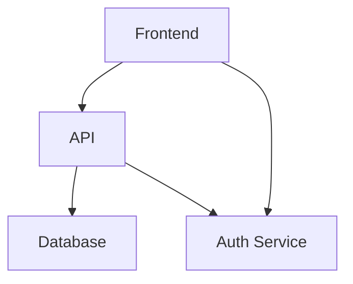

# 📚 Neovim Configuration: Statick - Tutorial Completo

Configuración personalizada de Neovim desarrollada por **Statick Medardo Saavedra García**, profesional de TI con más de 8 años de experiencia en desarrollo **Fullstack** y **Educación Superior**.

---

## 📋 Tabla de Contenidos

- [🎯 Día 1: Fundamentos de Neovim](#día-1-fundamentos-de-neovim)
- [🔍 Día 2: Búsqueda y Navegación](#día-2-búsqueda-y-navegación)
- [💡 Día 3: LSP y Autocompletado](#día-3-lsp-y-autocompletado)
- [🐙 Día 4: Git Integration](#día-4-git-integration)
- [📝 Día 5: Gestión de Notas con Obsidian](#día-5-gestión-de-notas-con-obsidian)
- [🎨 Día 6: Excalidraw - Diagramas](#día-6-excalidraw---diagramas)
- [🔬 Día 7: Quarto - Documentos Científicos](#-día-7-quarto---documentos-científicos)
- [🐦 Día 8: Flutter Development](#día-8-flutter-development)
- [🐍 Día 9: Python Development](#día-9-python-development)
- [🧪 Día 10: Testing](#día-10-testing)
- [🏗️ Stack Tecnológico](#stack-tecnológico)
- [📁 Estructura del Proyecto](#estructura-del-proyecto)
- [🔧 Solución de Problemas](#solución-de-problemas)

---

## 🎯 Día 1: Fundamentos de Neovim

### 📖 Modos de Neovim

Neovim tiene 4 modos principales que debes dominar:

| Modo | Tecla | Descripción | Cómo entrar |
|------|-------|-------------|------------------------|
| **Normal** | `Esc` | Navegar y ejecutar comandos | Presiona `Esc` desde cualquier modo |
| **Insert** | `i` | Escribir texto | Presiona `i` desde modo Normal |
| **Visual** | `v` | Seleccionar texto | Presiona `v` desde modo Normal |
| **Command** | `:` | Ejecutar comandos | Presiona `:` desde modo Normal |

### ⌨️ Comandos Esenciales

| Comando | Acción | Ejemplo |
|---------|--------|---------|-----------|
| `:w` | Guardar | `:w` - Guarda el archivo actual |
| `:q` | Salir | `:q` - Cierra Neovim |
| `:wq` | Guardar y salir | `:wq` - Combina w + q |
| `:q!` | Salir sin guardar | `:q!` - Cierra sin guardar cambios |
| `u` | Deshacer | `u` - Deshace el último cambio |
| `Ctrl+r` | Rehacer | `Ctrl+r` - Rehace el último deshacer |

### 🧭 Navegación Básica

| Tecla | Acción | Atajo alternativo |
|-------|--------|------------------|
| `h/j/k/l` | Izquierda/Abajo/Arriba/Derecha | ←/↓/↑/→ |
| `w` | Siguiente palabra | `e` |
| `b` | Palabra anterior | `ge` |
| `dd` | Borrar línea | `dd` (borra) + `yy` (copia) + `p` (pega) |
| `0` | Inicio de línea | `^` |
| `$` | Fin de línea | `G` |
| `gg` | Inicio del archivo | `1` |
| `G` | Fin del archivo | `:$` |

### 💡 Tu Primer Archivo

```bash
# 1. Crear un archivo de prueba
nvim hola_mundo.py

# 2. Escribir código Python
i
def saludo():
    print("¡Hola Mundo desde Neovim!")
    return "Funcionando correctamente"

# 3. Guardar y salir
<Esc>:wq
```

**Resultado esperado:**
```python
def saludo():
    print("¡Hola Mundo desde Neovim!")
    return "Funcionando correctamente"
```

### 💡 Tip Rápido: Salir del modo Insert

**Atajo personalizado:** `jj` (presiona `j` dos veces)

Configurado en: `lua/statick/core/keymaps.lua`

```bash
# Configurado en: lua/statick/core/keymaps.lua
keymap.set("i", "jj", "<ESC>")

# En modo Insert:
# Escribe "jj" → Vuelves al modo Normal automáticamente
```

---

## 🔍 Día 2: Búsqueda y Navegación

### 🎯 Which-key.nvim - Tu menú de atajos

**¿Qué es `<leader>`?**
- Es la tecla **Espacio** en esta configuración
- Configurado en: `vim.g.mapleader = " " "`

**Uso:**
```bash
# 1. Abrir Neovim
nvim

# 2. Presionar Espacio (tu leader)
# → Verás un menú organizado por categorías

# Ejemplo de menú que verás:
# ╭─────────────────────────────────────────╮
# │ +explorer        │
# │ +find           │
# │ +productivity    │
# │ +git            │
# │ +obsidian       │
# │ +python         │
# │ +flutter        │
# │ +testing        │
# │ +lsp            │
# │ +excalidraw     │
# │ +quarto         │
# │ +web            │
# │ +docker         │
# ╰─────────────────────────────────────────╯
```

**Explorando categorías:**
```bash
# 1. Presiona Espacio
# 2. Navega con flechas (↑/↓/←/→)
# 3. Selecciona una categoría

# Ejemplo de navegación:
↓  # Siguiente categoría
↑ # Categoría anterior
```

### 🔍 Telescope.nvim - Búsqueda Inteligente

**Comandos principales:**

| Atajo | Descripción | Uso práctico |
|-------|-------------|---------------|
| `<leader>ff` | Buscar archivos | `nvim archivo.py` → `<leader>ff` → `archivo.py` → Enter` |
| `<leader>fg` | Buscar texto | `nvim` → `<leader>fg` → `function` → Enter` → Navegar con `↓/↑` |
| `<leader>fb` | Buscar buffers | Presiona `<leader>fb` → Selecciona archivo abierto |
| `<leader>fh` | Buscar ayuda | Presiona `<leader>fh` → `help` → Enter` |

**Ejemplo práctico - Buscar una función:**
```bash
# 1. Abrir tu proyecto
nvim ~/tu-proyecto

# 2. Buscar texto (<leader>fg)
<leader>fg>

# 3. Escribe el texto a buscar
funcion

# 4. Navegar con flechas
↓ / ↑

# 5. Enter para abrir el archivo
<Enter>
```

**Características útiles de Telescope:**
- **Búsqueda fuzzy**: Escribe cualquier parte del nombre
- **Previsualización**: Ve el contenido antes de abrir
- **Filtros**: `Ctrl+f` para filtrar por tipo
- **Preview**: `Ctrl+p` para ver preview con teclado

### ⚡ Flash.nvim - Navegación Rápida

Flash te permite saltar a cualquier parte del archivo rápidamente.

| Atajo | Descripción | Uso |
|-------|-------------|------|
| `s` | Saltar a cualquier letra | Escribe la letra y presiona `s` para saltar |
| `S` | Saltar a Treesitter | Escribe `S` para saltar a función/clase |

**Uso práctico:**
```bash
# 1. Abrir un archivo grande
nvim archivo_grande.py

# 2. Buscar una palabra lejana
s
variable
# 3. El cursor saltó a la primera ocurrencia
# 4. Presiona Enter para confirmar
```

---

## 💡 Día 3: LSP y Autocompletado

### 🌟 nvim-cmp - Autocompletado Inteligente

**¿Qué es el autocompletado?**
- Sugiere funciones, variables, tipos mientras escribes
- Funciona como IntelliSense en VS Code
- Aparece automáticamente mientras escribes

**Fuentes de autocompletado:**
```bash
# nvim-cmp consulta estas fuentes en orden:

nvim_lsp     # LSP (prioridad más alta)
luasnip       # Snippets (fragmentos de código)
path           # Rutas de archivos
buffer         # Palabras del archivo actual

# Ejemplo en Python:
def mi_funcion():
    return "hola"
    │           ↑
    │     nvim_lsp, luasnip, path, buffer
```

**Atajos de autocompletado:**
| Tecla | Acción |
|-------|--------|-----------|
| `Tab` | Siguiente sugerencia | `Tab` → siguiente opción |
| `Enter` | Aceptar sugerencia | `Enter` → confirmar |
| `Ctrl+Space` | Forzar menú |

**Ejemplo práctico:**
```python
# 1. Crear un archivo Python
nvim test.py

# 2. Escribir código
import numpy as np

# 3. El autocompletado sugiere numpy
def procesar_datos(datos):
    return datos
```

# 4. Presiona Tab para aceptar
numpy
# → Se inserta: import numpy as np
```

### 🤖 LSP (Language Server Protocol)

**¿Qué es LSP?**
- Proporciona inteligencia de lenguaje
- Navegación a definiciones, referencias, documentación
- Errores, warnings, code actions

**Atajos principales:**
| Atajo | Descripción | Uso |
|-------|-------------|------|
| `gd` | Ir a definición | Colócate sobre función y presiona `gd` |
| `gr` | Buscar referencias | Colócate sobre función y presiona `gr` |
| `K` | Ver documentación | Colócate y presiona `K` |
| `]d` / `[d` | Siguiente/anterior error | Navega entre errores |
| `<leader>rn` | Renombrar símbolo | Renombra variable/función |
| `<leader>ca` | Code actions | `<leader>ca` → Ver acciones disponibles |
| `<leader>rn` | `:lua vim.lsp.buf.rename()`

**Ejemplo práctico completo:**
```python
# 1. Abrir un archivo Python con funciones
nvim proyecto/main.py

# 2. Ver definición de una función
def funcion_antigua(nombre):
    return nombre.upper()
    # Colócate en funcion_antigua
    # Presiona gd
# → El cursor salta a la definición

# 3. Ver documentación
# Colócate en funcion_nueva y presiona K
# → Verás la documentación

# 4. Renombrar función
# Colócate en funcion_nueva
# Presiona <leader>rn
# → Escribe nuevo nombre
new_funcion<Enter>

# 5. Code actions (arreglar problemas)
# Presiona <leader>ca
# → Verás opciones como:
#   • Fix all: Resolver todos los errores
#   • Organize imports: Organizar importaciones
```

---

## 🐙 Día 4: Git Integration

### 📊 Gitsigns.nvim - Indicadores de Cambios

**¿Qué son Gitsigns?**
- Muestra cambios en el gutter (margen izquierdo)
- Colores diferentes para cada tipo de cambio

**Indicadores visuales:**
```
+ Línea agregada (verde)
~ Línea modificada (amarillo)
- Línea eliminada (rojo)
_  Línea cambiada (azul)
```

**Atajos de Gitsigns:**
| Atajo | Descripción |
|-------|-------------|
| `]c` | Siguiente hunk | `]c` - Hunk anterior |
| `[c` | Hunk anterior | `[d` - Siguiente hunk |
| `<leader>hs` | Stage hunk | Agregar hunk al commit |
| `<leader>hr` | Reset hunk | Deshacer hunk |

**Ejemplo práctico:**
```bash
# 1. Abrir archivo modificado
nvim archivo_modificado.py

# 2. Verás indicadores en el gutter:
┌──────────────────────┐
│ + def nueva_funcion │ ← Línea agregada
│ ~     return False      │ ← Línea modificada
└──────────────────────┘

# 3. Navegar entre cambios
]c → Siguiente hunk
[c → Hunk anterior

# 4. Stage un hunk
# Presiona <leader>hs
# → Se agrega a commit

# 5. Reset hunk
Presiona <leader>hr
```

### 🎯 LazyGit.nvim - Interfaz Git Visual

**¿Qué es LazyGit?**
- Interfaz TUI (Terminal UI) para Git
- Similar a gitk pero más moderno

**Comandos principales:**
| Atajo | Descripción |
|-------|-------------|
| `s` | Status | `s` - Ver estado del repositorio |
| `f` | Files | `f` - Ver archivos |
| `c` | Commits | `c` - Ver commits |
| `b` | Branches | `b` - Ver ramas |

**Ejemplo práctico:**
```bash
# 1. Abrir LazyGit
nvim
<leader>gg

# 2. Verás la interfaz visual:
# ╔══════════════════════════════╗
# │ 📁 Files    │ 📊 Status    │ 📝 Commits   │ 🔀 Branches  ╮
# ╚════════════════════════════╝

# 3. Navegar con teclado
#   s: Status
#   f: Files
#   c: Commits
#   b: Branches

# 4. Usar comandos:
#   s: Stage (agregar archivos)
#   c: Commit (crear commit)
#   ?: Ver ayuda
```

### 🔍 Diffview.nvim - Visualización de Diffs

**¿Qué es Diffview?**
- Visualiza cambios lado a lado
- Comparar commits, branches, archivos

**Atajos principales:**
| Atajo | Descripción |
|-------|-------------|
| `<leader>gvo` | Abrir diffview | Abre comparación lateral |
| `<leader>gvc` | Cerrar diffview | Cierra comparación |
| `<leader>gq` | Abrir diffview (otra vez) |

**Ejemplo práctico:**
```bash
# 1. Abrir diffview
nvim
<leader>gvo

# 2. Verás comparación:
# ┌──────────────────────┐
# │ Archivo local     │ Archivo remoto   │
# ├─────────────────┼───────────────────┤
# │ - linea1         │   - linea1        │
# │   linea2         │   + linea2        │
# │   linea3         │   ~ linea3        │
# └─────────────────┴───────────────────┘

# 3. Navegar entre archivos
#   Tab/I: Cambiar entre archivos
#   [d: Cambio siguiente
```

### 🔀 Git-conflict.nvim - Resolver Conflictos

**Atajos para resolver conflictos:**
| Atajo | Descripción |
|-------|-------------|
| `<leader>gco` | Elegir "ours" | Tus cambios |
| `<leader>gct` | Elegir "theirs" | Cambios del otro |
| `<leader>gcb` | Elegir "both" | Ambas versiones |
| `<leader>gc0` | Elegir "none" | Ninguna versión |

**Ejemplo práctico:**
```bash
# 1. Archivo con conflicto:
<<<<<<< HEAD
def funcion_conflictiva():
    return "version_local"
=======
    return "version_remota"
>>>>>>> branch-feature
    pass
```

# 2. Colócate en el conflicto
# 3. Presiona <leader>gco para elegir tu versión
# Resultado:
def funcion_conflictiva():
    return "version_local"
```

---

## 📝 Día 5: Gestión de Notas con Obsidian

### 📚 Obsidian.nvim - Tu Sistema de Notas

**¿Qué es Obsidian?**
- Sistema de gestión de notas potente
- Compatible con Obsidian app y standalone
- Links bidireccionales (backlinks)
- Plantillas, tags, diarios
- Búsqueda y cambio rápido entre notas

### ⌨️ Atajos de Obsidian

| Atajo | Descripción | Uso |
|-------|-------------|------|
| `<leader>on` | Nueva nota | `<leader>on` → Crea nueva nota en Obsidian |
| `<leader>oo` | Buscar notas | `<leader>oo` → Abrir buscador de notas |
| `<leader>os` | Cambiar nota | `<leader>os` → Abrir otra nota |
| `<leader>ot` | Nota de hoy | `<leader>ot` → Abrir nota diaria actual |
| `<leader>oy` | Nota de ayer | `<leader>oy` → Abrir nota de ayer |
| `<leader>om` | Nota de mañana | `<leader>om` → Abrir nota de mañana |
| `<leader>ob` | Ver backlinks | `<leader>ob` → Ver qué notas enlazan a esta |
| `<leader>ol` | Ver links internos de esta |
| `<leader>oc` | Seguir link | `<leader>oc` → Ir a la nota enlazada |
| `<leader>oi` | Pegar imagen | `<leader>oi` → Pegar imagen desde clipboard |
| `<leader>ota` | Tabla de contenidos | `<leader>ota` → Mostrar tabla de contenidos |
| `<leader>otp` | Insertar plantilla | `<leader>otp` → Insertar plantilla guardada |

### 📝 Tutorial Completo de Obsidian

#### Paso 1: Crear tu primera nota

```bash
# 1. Abrir Neovim
nvim

# 2. Crear nueva nota
<leader>on

# 3. La nota se crea automáticamente
# Nombre: ~/Documents/notes/<timestamp>.md

# 4. Escribe contenido:
---
# Esta es mi primera nota en Obsidian.

## Características
- [[Links bidireccionales]]
- [[Tags]]
```

# 5. Guardar
:wq
```

#### Paso 2: Crear nota diaria

```bash
# 1. Abrir nota de hoy
<leader>ot

# 2. Se crea automáticamente
# Nombre: ~/Documents/notes/daily/2026-01-03.md

# 3. Contenido ejemplo:
---
date: 2026-01-03
tags: [daily]

## Tareas del día
- [ ] Revisar código
- [ ] Actualizar documentación
- [ ] Revisar PRs
```

#### Paso 3: Crear links entre notas

```bash
# 1. Abrir nota A
nvim ~/Documents/notes/proyecto_alpha.md

# 2. Añadir link a nota B
## Enlaces importantes

- [[proyecto_beta]]: Proyecto relacionado

# 3. Colócate en el link y presiona:
<leader>oc

# 4. Obsidian te lleva a la nota destino
```

#### Paso 4: Usar plantillas

```bash
# 1. Crear archivo de plantilla
nvim ~/Documents/notes/templates/reunion.md

# 2. Contenido:
---
date: {{ date }}
tags: [template]

# 1. Reunión

## Notas
- [ ]
- [ ]
- [ ]

# 3. Guardar
:wq
```

# 4. Usar plantilla en nueva nota:
<leader>otp

# 5. Selecciona la plantilla
# 6. Presiona Enter para insertar contenido
```

#### Paso 5: Búsqueda avanzada con Obsidian

```bash
# 1. Buscar notas (<leader>oo)
nvim

# 2. Escribir texto a buscar
proyecto

# 3. Navegar con flechas:
↓ / ↑

# 4. Enter para abrir
<Enter>
```

**Características de búsqueda de Obsidian:**
- **Búsqueda fuzzy**: Escribe cualquier parte del nombre
- **Backlinks**: Ver qué notas enlazan a cada nota
- **Cambio rápido**: Cambia entre notas con `<leader>os`

---

## 🎨 Día 6: Excalidraw - Diagramas

### 🎯 ¿Qué es Excalidraw?

- **Diagramas en Markdown**
- Integración directa con Excalidraw online
- No necesitas salir de Neovim
- Crea diagramas UML, arquitectura, wireframes

### ⌨️ Atajos principales

| Atajo | Descripción |
|-------|-------------|
| `<leader>ed` | Abrir link bajo cursor | `<leader>ed` → Abre en Excalidraw |
| `<leader>ec` | Crear nueva escena | `<leader>ec` → Crea diagrama nuevo |
| `<leader>et` | Crear desde plantilla | `<leader>et` → Crea desde plantilla |
| `<leader>ef` | Buscar escenas guardadas | `<leader>ef` → Lista escenas |
| `<leader>el` | Listar escenas en buffer | `<leader>el` → Links en el buffer |

### 📊 Tutorial Completo de Excalidraw

#### Paso 1: Crear diagrama de arquitectura

```bash
# 1. Abrir archivo Markdown
nvim arquitectura.md

# 2. Crear nueva escena
<leader>ec

# 3. Se abre Excalidraw en el navegador
# 4. Crea tu diagrama

# Ejemplo de arquitectura:



# 5. Guardar en Excalidraw
# 6. Presiona el botón de guardado
```

#### Paso 2: Insertar diagrama en Markdown

```bash
# 1. Vuelve a Neovim
nvim

# 2. Abrir tu archivo Markdown
nvim arquitectura.md

# 3. Colócate donde quieres el diagrama
# 4. Presiona Enter para pegar diagrama:

# Resultado:
# [excalidraw:diagrama_id]()
```

---

## 🔬 Día 7: Quarto - Documentos Científicos

### 📚 ¿Qué es Quarto?

- **Documentos científicos** con código ejecutable
- Markdown + Python + Julia + más lenguajes
- Publicación a HTML, PDF, beamer
- Código ejecutable en celdas

### ⌨️ Atajos de Quarto

| Atajo | Descripción | Uso |
|-------|-------------|------|
| `]b` / `[b` | Navegar celdas | `]b` - Celda anterior | `]b` - Celda siguiente |
| `<localleader>rc` | Ejecutar celda | `<localleader>rc` → `rc` → Ejecuta celda actual |
| `<localleader>ra` | Ejecutar celda y anteriores | `<localleader>ra` → Ejecuta celdas desde aquí |
| `<localleader>rA` | Ejecutar todas | `<localleader>rA` → Ejecuta todas las celdas |
| `<localleader>rl` | Ejecutar línea actual | `<localleader>rl` → Ejecuta línea actual |
| `<localleader>pp` | Previsualizar | `<localleader>pp` → Previsualiza HTML (renderizado) |
| `<localleader>ps` | Detener previsualización | `<localleader>ps` → Detener previsualización |
| `<localleader>qi` | Inspectar documento | `<localleader>qi` → Inspectar metadatos |
| `<localleader>qf` | Formatear documento | `<localleader>qf` → Formatear documento |

### 📊 Tutorial Completo de Quarto

#### Paso 1: Crear tu primer documento Quarto

```bash
# 1. Crear archivo .qmd
nvim analisis.qmd

# 2. Escribe código Python en celdas
```python
import pandas as pd
import matplotlib.pyplot as plt

# 3. Cargar datos
datos = pd.read_csv('datos.csv')

# 4. Visualizar
plt.plot(datos['x'], datos['y'])
plt.show()
```

#### Paso 2: Ejecutar celda actual

```bash
# 1. Colócate en una celda Python
localleader>rc

# 2. Ejecutar celda
<localleader>rc

# 3. Ver resultados en la ventana flotante
```

#### Paso 3: Ejecutar todas las celdas

```bash
# 1. Ejecutar todo el documento
<localleader>rA

# 2. Ver resultados en consola
```

---

## 🐦 Día 8: Flutter Development

### 🎯 Plugins de Flutter

| Herramienta | Descripción |
|-------------|-------------|
| [flutter-tools.nvim](https://github.com/nvim-flutter/flutter-tools.nvim) | Herramientas Flutter para Neovim |
| [dartls](https://github.com/dart-lang/sdk/tree/main/pkg/analysis_server) | LSP para Dart |

### ⌨️ Atajos de Flutter

| Atajo | Descripción | Uso |
|-------|-------------|------|
| `<leader>F` | Run Flutter app | `<leader>F` → Ejecuta app de Flutter |
| `<leader>D` | Devices | `<leader>D` → Lista dispositivos disponibles |
| `<leader>Q` | Quit Flutter | `<leader>Q` → Detener aplicación |
| `<leader>R` | Hot Reload | `<leader>R` → Recarga sin reiniciar |
| `<leader>H` | Hot Restart | `<leader>H` → Reiniciar completamente |

### 📱 Tutorial Completo de Flutter

#### Paso 1: Abrir proyecto Flutter

```bash
# 1. Abrir proyecto Flutter
nvim mi_app_flutter

# 2. Verás que el LSP se activa
# Dartls se inicia automáticamente

# 3. Autocompletado de Flutter disponible
```

#### Paso 2: Ejecutar aplicación

```bash
# 1. Ejecutar
<leader>F>

# 2. Ver output en ventana flotante
# Logs, errores, etc. en tiempo real
```

#### Paso 3: Hot Reload

```bash
# 1. Modifica el código
def actualizar_estado():
    return "estado_actualizado"
    # Cambio rápido

# 2. Hot reload
<leader>R>

# 3. La app se recarga sin reiniciar
# Presiona <leader>H
```

---

## 🐍 Día 9: Python Development

### 🐍 Plugins de Python

| Herramienta | Descripción |
|-------------|-------------|
| [pyright](https://github.com/microsoft/pyright) | LSP para Python |
| [venv-selector.nvim](https://github.com/linux-cultist/venv-selector.nvim) | Selector de entornos virtuales |
| [neogen](https://github.com/danymas/neogen) | Generador de docstrings |

### ⌨️ Atajos de Python

| Atajo | Descripción | Uso |
|-------|-------------|------|
| `<leader>vs` | Seleccionar env virtual | `<leader>vs` → Abre selector de venvs |
| `<leader>nd` | Generar docstring | `<leader>nd` → Genera docstring |

### 📊 Tutorial Completo de Python

#### Paso 1: Abrir archivo Python

```bash
# 1. Crear archivo Python
nvim script.py

# 2. El LSP Pyright se activa automáticamente
# Autocompletado disponible
```

#### Paso 2: Autocompletado en acción

```python
# 1. Escribir código
import numpy as np

# 2. El autocompletado sugiere:
#    ┌──────────────────────────────┐
#    │ import pandas as pd         │
#    │ import numpy as np          │
#    │ import pytorch as pt          │
#    └──────────────────────────────┘

# 3. Presiona Tab o Enter
# → Se acepta sugerencia
```

#### Paso 3: Generar docstring

```python
# 1. Colócate en una función
def calcular_promedio(numeros: list[float]) -> float:
    """
    # Colócate aquí
    """
    return sum(numeros) / len(numeros)

# 2. Generar docstring
<leader>nd>

# 3. Se genera automáticamente:
"""
Calcula el promedio de una lista de números.

Args:
    numeros: Lista de números para calcular

Returns:
    float: Promedio de los números
"""
```

#### Paso 4: Seleccionar virtual environment

```bash
# 1. Abrir selector de venvs
<leader>vs

# 2. Verás lista:
# ╔══════════════════════════════╗
# │ venv1 (python3.9)       │
# │ venv2 (python3.10)      │
# │ venv3 (python3.11)      │
# ╚════════════════════════════╝

# 3. Navegar y seleccionar con Enter
# 4. El LSP usa la versión del venv seleccionado
```

---

## 🧪 Día 10: Testing

### 🧪 Plugins de Testing

| Herramienta | Descripción |
|-------------|-------------|
| [vim-test](https://github.com/vim-test/vim-test) | Framework de testing |
| [nvim-dap](https://github.com/mfussenegger/nvim-dap) | Debugger (integrado con testing) |

### ⌨️ Atajos de Testing

| Atajo | Descripción | Uso |
|-------|-------------|------|
| `<leader>tn` | Test nearest | `<leader>tn` → Test más cercano al cursor |
| `<leader>tf` | Test file | `<leader>tf` → Test todo el archivo |
| `<leader>ts` | Test suite | `<leader>ts` → Test suite completa |
| `<leader>tv` | Test visit | `<leader>tv` → Ir al último test |
| `<leader>tg` | Test go | `<leader>tg` → Ir a tests fallidos |

### 📊 Tutorial Completo de Testing

#### Paso 1: Ejecutar test más cercano

```bash
# 1. Abrir archivo de tests
nvim tests/test_usuario.py

# 2. Colócate en un test
def test_usuario_valido():
    usuario = Usuario("juan", "juan@email.com")
    assert usuario.validar()

# 3. Ejecutar test
<leader>tn

# 4. Ver resultado:
# ✅ test_usuario_valido PASSED
```

#### Paso 2: Ejecutar todos los tests del archivo

```bash
# 1. Ejecutar suite completa
<leader>ts

# 2. Verás resumen:
# ✅ 15 tests ejecutados
# ✅ 13 PASSED
# ✅ 2 FAILED
```

#### Paso 3: Ejecutar test visit

```bash
# 1. Ir al último test ejecutado
<leader>tv

# 2. Verás código que causó el fallo
# ← Ir a la línea con error
```

---

## 🏗️ Stack Tecnológico

### Core

| Herramienta | Descripción |
|-------------|-------------|
| [Lazy.nvim](https://github.com/folke/lazy.nvim) | Gestor de plugins moderno |
| [Which-key.nvim](https://github.com/folke/which-key.nvim) | Menú visual de atajos |
| [Catppuccin](https://github.com/catppuccin/nvim) | Tema visual moderno |
| [Treesitter](https://github.com/nvim-treesitter/nvim-treesitter) | Resaltado de sintaxis avanzado |

### Desarrollo

| Herramienta | Descripción |
|-------------|-------------|
| [Mason.nvim](https://github.com/williamboman/mason.nvim) | Gestión de servidores LSP |
| [nvim-lspconfig](https://github.com/neovim/nvim-lspconfig) | Configuración LSP |
| [nvim-cmp](https://github.com/hrsh7th/nvim-cmp) | Autocompletado |
| [Telescope.nvim](https://github.com/nvim-telescope/telescope.nvim) | Búsqueda inteligente |

### Herramientas Especializadas

| Herramienta | Descripción |
|-------------|-------------|
| [Neo-tree.nvim](https://github.com/nvim-neo-tree/neo-tree.nvim) | Explorador de archivos |
| [Quarto.nvim](https://github.com/quarto-dev/quarto-nvim) | Documentos científicos |
| [Gitsigns.nvim](https://github.com/lewis6991/gitsigns.nvim) | Integración Git |
| [Tmux.nvim](https://github.com/aserowy/tmux.nvim) | Integración tmux |
| [Diffview.nvim](https://github.com/sindrets/diffview.nvim) | Visualización de diffs |
| [Git-conflict.nvim](https://github.com/akinsho/git-conflict.nvim) | Resolver conflictos |
| [Excalidraw.nvim](https://github.com/CRAG666/excalidraw.nvim) | Diagramas visuales |
| [Obsidian.nvim](https://github.com/epwalsh/obsidian.nvim) | Gestión de notas (Obsidian) |
| [Flash.nvim](https://github.com/folke/flash.nvim) | Navegación rápida |
| [Trouble.nvim](https://github.com/folke/trouble.nvim) | Diagnósticos y errores |
| [GGA](https://github.com/Gentleman-Programming/gentleman-guardian-angel) | Revisión de código con IA |

---

## 📁 Estructura del Proyecto

```
~/.config/nvim/
├── init.lua                    # Punto de entrada
├── lazy-lock.json              # Versiones de plugins
└── lua/
    └── statick/
        ├── core/
        │   ├── options.lua     # Opciones de Neovim (30 líneas)
        │   └── keymaps.lua     # Atajos de teclado (165 líneas)
        └── plugins/
            ├── autopairs.lua   # Pares automáticos
            ├── colorscheme.lua # Tema visual (Catppuccin)
            ├── completions.lua # Autocompletado mejorado
            ├── excalidraw.lua  # Diagramas
            ├── flutter-dev.lua # Flutter (configuración mínima)
            ├── git.lua         # Git integration
            ├── gga.lua         # GGA - AI Code Review
            ├── help.lua        # Which-key
            ├── lsp.lua         # LSP servers
            ├── markdown.lua    # Markdown render
            ├── neotree.lua     # Explorador
            ├── obsidian.lua    # Gestión de notas Obsidian
            ├── opencode.lua    # Clean Architecture (deshabilitado)
            ├── productivity.lua
            ├── python-dev.lua
            ├── quarto.lua      # Quarto
            ├── telescope.lua   # Búsqueda
            ├── testing.lua     # Testing
            ├── tmux.lua        # Tmux
            ├── treesitter.lua  # Syntax
            ├── web-dev.lua     # Web dev
            └── ...             # Más plugins especializados
```

---

## 🔧 Solución de Problemas

### "No funciona autocompletado"

```bash
:LspInfo          # Verificar LSP activo
:LspRestart       # Reiniciar LSP
```

### "No se ven los colores"

```bash
:TSInstallInfo    # Ver parsers instalados
:TSInstall python # Instalar parser de Python
```

### "Which-key no aparece"

```bash
:Lazy             # Verificar instalación
# Presionar <leader> lentamente
```

### "Tmux navigation no funciona"

```bash
# Verificar que estás en tmux
tmux ls

# Verificar plugin cargado
:checkhealth tmux
```

### Error de LSP

```bash
# Verificar servidores instalados
:Mason

# Instalar servidor faltante
:LspInstall <nombre>
```

### GGA no funciona

```bash
# Verificar instalación
which gga
gga version

# Verificar proveedor
gga config

# Probar manualmente
gga run
```

---

## 🔄 Cambios Recientes

### v3.3 - Enero 2026

- ✅ **Tutorial README reescrito**: README transformado en guía didáctica completa paso a paso (10 días)
- ✅ **help.lua mejorado**: Sistema de ayuda contextual con Which-key
  - Descripciones detalladas para todos los comandos principales
  - Iconos visuales para cada categoría (explorer, find, git, obsidian, etc.)
  - Configuración mejorada del popup (borde redondeado, winblend, padding)
  - Mapeo de atajos principales: Telescope, LSP, Trouble, Git
  - Notificación de carga del sistema de ayuda
- ✅ **Obsidian.nvim agregado**: Gestión completa de notas
  - Notas diarias (today, yesterday, tomorrow)
  - Búsqueda y cambio rápido entre notas (Telescope integration)
  - Plantillas y backlinks
  - Links inteligentes (wiki y markdown)
  - Tabla de contenidos
  - 11 atajos dedicados (on, oo, os, ot, oy, om, ob, ol, oc, oi, ota, otp)

### v3.2 - Enero 2026

- ✅ **Obsidian.nvim agregado**: Gestión completa de notas
  - Notas diarias (today, yesterday, tomorrow)
  - Búsqueda y cambio rápido entre notas (Telescope integration)
  - Plantillas y backlinks
  - Links inteligentes (wiki y markdown)
  - Tabla de contenidos
- Compatibilidad completa con Markdown
- ✅ **Keymaps agregados**: 11 atajos nuevos para Obsidian
- ✅ **Lazy loading**: Obsidian se activa solo en archivos markdown
- ✅ **Total plugins**: 62 plugins + obsidian.nvim

### v3.1 - Enero 2026

- ✅ **LSP corregido**: Bug crítico en línea 123 (vim.lsp.get_log_path() → mapping correcto)
- ✅ **Completions mejoradas**: Agregado cmp-path, cmp-buffer, snippets predefinidos, Tab navigation
- ✅ **Telescope actualizado**: tag "0.1.8" → latest + fzf-native para búsquedas ultra rápidas
- ✅ **Git optimizado**: Eliminado Blamer.nvim (lento), configuración mejorada de gitsigns
- ✅ **Options expandidas**: +13 opciones útiles (signcolumn, clipboard, scroll, etc.)
- ✅ **Código comentado eliminado**: 82 líneas removidas (OpenCode, GGA desactivado)
- ✅ **Git-conflict mejorado**: default_mappings=false con highlights personalizados

### v3.0 - Enero 2026

- ✅ **Total plugins**: 52 plugins instalados, 20 configuraciones personalizadas

---

## 📚 Recursos

- [Documentación Neovim](https://neovim.io/doc/)
- [Vimtutor](https://tutor.dev/) - Tutorial interactivo
- [Lazy.nvim](https://github.com/folke/lazy.nvim)
- [Telescope](https://github.com/nvim-telescope/telescope.nvim)
- [Quarto](https://quarto.org/)
- [Obsidian](https://github.com/epwalsh/obsidian.nvim)
- [Excalidraw](https://github.com/CRAG666/excalidraw.nvim)
- [GGA Repo](https://github.com/Gentleman-Programming/gentleman-guardian-angel)
- [GGA Documentación](https://github.com/Gentleman-Programming/gentleman-guardian-angel?tab=readme-ov-file#-providers)

---

**Statick Medardo Saavedra García** - 2026
